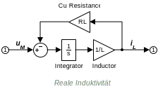

Title:  Projekt Galvo-Scanner  
Author: Del Basso, Manuel  
Date:   WHZ, November, 2016  

Projekt __Galvo-Scanner__
=========================== 

[TOC]

# Einleitung #
Im Rahmen der hier vorgestellten Projektarbeit wurde über einen Zeitraum von ca. 12 Monaten ein System entworfen und aufgebaut, bei dem der Projekt-Schwerpunkt ___bewusst___ nicht auf ein einzelnes Teilgebiet des Studiengangs "Nachrichtentechnik – Informationstechnik" beschränkt werden sollte. Die praxisbezogenen Kursinhalte und Laborveranstaltungen des Grundstudiums, vertiefen die erlernten theoretischen Grundlagen und zeigen teilweise auch Methoden zur (Computer-)Modellbildung und/oder Simulation im jeweiligen Teilgebiet auf. 

* Analog-/Digitaltechnik 
* Felder-Theorie (magnetische / elektrische)    
* Wechselstromlehre
* Mikrocontroller-Technik
* Hardwarebeschreibung (VHDL)
* Simulation von elektrischen Netzwerken (SPICE)
* abstrakten Systembeschreibung (Laplace, Fourier)
* Regelungstechnik
* Diskretisierung von Systemen

Einige konkreFür die Umsetzung eines  ___Systemplanung___ wie auch für die spätere Umsetzung als grundlegend und unerlässlich angesehen wird. Einige öffentliche Vorträge zum Thema "System Konzeption und Beschreibung in der Praxis" wurden am Karlsruher Institut für Technologie (KIT, Universität Karlsruhe) besucht. Dadurch konnten ergänzende Inhalte zum HsKA-Modul "Embedded Systems" erarbeitet und teils auch bei der konkreten Teilsystem-Auslegung umgesetzt werden. 

# Vorarbeit #
Es folgen einige Worte zur Frage "Wie kam es zu dem Projekt?" und "Was wurde letztendlich Umgesetzt?". Das ursprüngliche Projektvorhaben wurde nur teilweise umgesetzt, soll aber hier der Vollständigkeit halber erwähnt werden. 

## Ursprüngliche Motivation ##
Der Besuch einer mehrtägigen Schulungsveranstaltung der Firma _ANSYS_[^fnWikiAnsys] mit Schwerpunkt _ANSYS_ _Maxwell_[^fnMaxwell] sowie _ANSYS_ _Simplorer_[^fnSimplorer] im Rahmen meiner Formula Student Mitgliedschaft, weckte das Interesse an einem Projekt im Bereich "Multiphysik und Systemsimulation". Der nachfolgende Abschnitt "Projektziel" wurde der ursprünglichen Projektanfrage entnommen. Weitere Details sowie erste Simulationsergebnisse (Maxwell FEM-Modell + Simplorer Regelkreis), können in der ursprünglichen Projektanfrage[^fnAnfrageBrunner] eingesehen werden. 

><a name="refProjectDesc"/> Ziel des Projektes ist </a> der Aufbau eines funktionsfähigen XY-Galvanometer-Scanners mit selbstentworfenen Galvanometer-Motoren + Leistungstreiber und eines in C implementierten Software-Reglers (...). Als Galvanometer-Motor-Typ ist ein "Moving magnet motor" geplant. Um die Motorkonstruktion einfach zu halten, ist ein Stator Design mit nur einem Polpaar angedacht.

>Unter Zuhilfenahme der FEM-Simulationsumgebung "Maxwell" und "Simplorer", sollen Reglerparameter anhand eines nichtlinearen Modells des Galvanometer-Motors optimiert werden. Die Sollwert-Vorgaben für die XY-Winkelpositionen werden vorerst als einfache Lookup-Tabellen direkt auf dem Mikrocontroller erzeugt, welcher auch die diskreten Reglerfunktionen übernehmen soll. 

>Sollte das geplante System soweit funktionieren, dass mit dem Scanner einfache geometrische Figuren erzeugt werden können (Kreise, Quadrate, Achter, ...), könnte eine PC-Software zur Erzeugung von Pixelkoordinaten inkl. Dunkeltastung des Lasers als Erweiterung angedacht werden.
    

Statische sowie dynamische Eigenschaften der in ANSYS Maxwell konstruierten Aktoren werden auf Basis finiter Elemente modelliert und in einem Multi-Domain-Modell[^fnMultiDomain] abgebildet. 
    
## Fertigungsproblematik ##
Die Motorkonstruktion konnte nie vollständig an einem funktionsfähigen Prototypen getestet werden. Hierzu werden folgende Begründungen genannt:

1. Unzureichende dynamische Eigenschaften (Rotormasse, Stabmagnet)
2. Kostenintensive / nicht vor Ort durchführbare mechanische Fertigungsschritte
3. Bearbeitung des Neodym Materials (Rotormagnet) nicht umsetzbar 
4. Bearbeitung des aus Ferrit Pulver gepressten Statorkerns schwer umsetzbar 
5. Verfügbarkeit ungenutzter, professioneller Galvanometer-Motoren

Das "unzureichend" bezieht sich auf das in Abschnitt Error: Reference source not found (Zitat, letzter Abschnitt) formulierte Projektziel. Um die dynamischen Eigenschaften zu verbessern, wäre die mechanische Bearbeitung von Zukaufteilen notwendig gewesen. Nach einigen gemeinsamen Recherchen mit den Werkzeug-Spezialisten des ansässigen Instituts für Materialien und Prozesse (IMP), wurde von einer maschinellen Bearbeitung abgeraten.[^fnArnoldMagn]

## Industriell gefertigte Aktoren ##
Für die weitere Umsetzung des Projekts kamen gebrauchte Spiegel-Galvanometer der Firma "Cambridge Technology Inc." zum Einsatz. Da keine herstellerspezifischen Informationen über den mechanischen Aufbau der Cambridge Galvanometer zur Verfügung standen, konnte die in Abschnitt [Ursprünglich Motivation](#ursprungliche-motivation) sowie die in [brun1] beschriebene Multi-Domain-Softwarelösung im weiteren Projektverlauf nicht mehr eingesetzt werden.  
Eine zerstörungsfreie Demontage der vorhanden Aktoren konnte nicht gewährleistet werden. Außerdem ließe der innere mechanische Aufbau keine Rückschlüsse auf die wichtigen Materialeigenschaften des Rotors bzw. Statorkerns zu.   

Durch eine sorgfältige Strukturierung des Projektablaufs hätte u. U. Zeit gespart werden können. Die erarbeiteten Kenntnisse im Bereich "Multiphysik und Systemsimulation" sind keines falls umsonst gewesen. Hinsichtlich der produktiven Bearbeitung von Projekten, lässt der bisherige Ablauf jedoch viel Kritik zu. Fertigungsprozesse unterliegen grundsätzlich irgend welchen Einschränkungen. Bereits während der Recherche zum Thema Permanentmagnet, wäre eine Anfrage über die Bearbeitbarkeit notwendig gewesen!

# Terminologie #
Auf häufig wiederkehrende Begriffe wie z. B. Modell, Modellbildung oder System, soll hier kurz eingegangen werden da sie als Überbegriffe sehr universell definiert sein können. 

## Galvanometer* ##
>Ein Galvanometer-Scanner ist ein hochdynamisches elektro-optisches Bauteil, bei dem <a style="color: #ddd ">ein</a> drehbare Spiegel von geringer Trägheit verwendet werden, um einen Laserstrahl mit hoher Genauigkeit und Wiederholbarkeit zu positionieren. Der Name Galvanometer bezieht sich auf den Motor-Typ.[^fnGalvoScanlab]

## System ##
Es gibt sehr abstrakte Definitionen des System-Begriffs. Auch in der soziologischen Systemtheorie werden System-Begriffe formuliert so dass z.B. durch menschliche Handlungen ein abstraktes Modell eines sozialen Systems angeregt bzw. dessen Systemantwort beschrieben werden kann. Eine sehr universelle Definition lautet z. B.:

> "__System:__ a set of physical entities that interact and are observable, where the entities can be a specified quantity of matter or a volume in space." [^fnChRoy]
>
 Eine Menge von physikalischen Einheiten die interagieren und beobachtbar sind, wobei sie eine definierte Menge Materie (bzw. eine bestimmte Anzahl an Teilchen) oder ein physischer Körper im Raum sein können. 

Im folgenden "beschränken" wir uns auf den System-Begriff im Sinne der Systemtheorie als elementare Disziplin der Ingenieurswissenschaften. Systeme und Signale sind die beiden wichtigsten Konzepte der Systemtheorie. In der Praxis werden Gebilde oder Konstrukte als System bezeichnet, die bei Anregung mit einem Eingangssignal *x(t)* mit einem Ausgangssignal *y(t)* reagieren.[^fnRUnb] 

Ein Gesamtsystem fügt sich aus Teilsystemen zusammen. Je nach Komplexität der übergeordneten Aufgabe (Wie "dick" sind Pflichten- und Lasten- Heft?) entstehen zahlreiche Abstraktionsebenen die es zu *dokumentieren* und meist auch zu warten gilt. 

Hinsichtlich eines _Software-Systems_ wird der Begriff _System_ in der [IEEE 1471][ieee1471] wie folgt definiert:
>Ein System ist ein aus Teilen zusammengesetztes und strukturiertes Ganzes. Es hat eine Funktion, erfüllt einen Zweck und verfügt über eine Architektur. [[MDA:2006, p.57]][@MDA:2006]

<!-- Der Begriff System ist hier und im Folgenden als Abkürzung für Teilsystem zu verstehen. -->

## Modell ##
Um ein Modell beschreiben zu können, muss zuvor das System *gewählt* werden, dessen tatsächliche Eigenschaften über den *__Prozess__ der Modellbildung* abstrahiert werden soll. Auch für den Begriff *Modell* finden sich zahlreiche Definitionen in der Literatur. Einige eignen sich sehr gut zur Definition im Sinne technischer Zusammenhänge und Computersimulationen Einige werden im folgenden zitiert: 
Die Grundlagen der Modellierung schuf Herbert Stachowiak 1973 mit der Veröffentlichung der "Allgemeinen Modelltheorie". Demnach ist ein Modell durch __Abbildung__, __Verkürzung__ und __Pragmatismus__ gekennzeichnet.[^fnStachowiak]

>__*Abbildung*__
Ein Modell ist stets ein Modell von etwas – nämlich Abbildung oder Repräsentation eines natürlichen oder eines künstlichen Originals, wobei dieses Original selbst auch wiederum ein Modell sein kann.

>__*Verkürzung*__
Ein Modell erfasst im Allgemeinen nicht alle Attribute des Originals, sondern nur diejenigen, die dem Modellschaffer bzw. Modellnutzer relevant erscheinen.

>__*Pragmatismus*__
Modelle sind ihren Originalen nicht eindeutig zugeordnet. Sie erfüllen ihre Ersetzungsfunktion für

> 1.   bestimmte Subjekte (für wen?)
> 2.   innerhalb bestimmter Zeitintervalle (wann?)
> 3.   unter Einschränkung auf bestimmte gedankliche oder tätliche Operationen (wozu?).

Eine kompaktere Definition wurde einem Lehrbuch _"Grund- und Leistungskurs Informatik"_ von _Karl-Hermann Rollke_ und _Klaus Sennholz_ entnommen: 

>Ein *Modell* ist ein durch Abstraktion (__Reduzierung__ und Verallgemeinerung) gewonnenes __Abbild__ eines bestimmten Ausschnitts der Realität. Das Modell wird zu dem Zweck entworfen, den für die Lösung eines *bestimmten* Problems relevanten Teil der Wirklichkeit für den Menschen oder eine Maschine (Computer) überschaubar und *operationalisierbar* zu machen.[^fnRoSe]

<a style="background-color: yellow;"> ...ist es wichtig, den Systemgrad minimal zu halten.
Die folgende Beispielaufgabe soll diesen Zusammenhang etwas greifbarer darstellen: </a>

### Beispiel ###
Für eine analoge Filterschaltung wird ein mathematisches Modell gefordert. Die Schaltung soll zur Tiefpassfilterung in einer __Highend-HiFi__ Stereoanlage eingesetzt werden. Für den Übergang vom Durchlass- in den Sperrbereich ist eine Dämpfung von 20dB/Dekade vorgegeben. Anhand des Modells soll das Dämpfungsverhalten mittels einiger harmonischer Testsignale untersucht werden können. 

#### Möglichkeit 1 ####
Man leitet aus den Anforderungen ab, dass ein Standard Filter mit Tiefpasscharakter 1. Ordnung gefordert ist. Da es sich beim Endprodukt um eine Highend-Anlage handelt, sollte ein möglichst präzises Modell formuliert werden. Unter Berücksichtigung aller tatsächlich parasitärer Größen von passiven Bauelementen[^fnElektrBauelem] wie Serieninduktivität (ESL) und Serienwiderstände (ESR) der Anschlussdrähte/Anordnung der Elektroden, der Isolationswiderstände und der dielektrischen Absorption (Nachladeeffekt, Rda, Cda), ergibt sich für einen einfachen RC-Tiefpass mit einer Dämpfungsflanke von 20dB/Dekade, das nebenstehende Schaltbild. Da die Ordnung eines Systems direkt aus der Anzahl seiner unabhängigen Energiespeicher abgeleitet werden kann, muss dem geforderten mathematischen Modell eine __Differentialgleichung 5. Ordnung__!!! zugrunde gelegt werden. 

#### Möglichkeit 2 ####
... dgl der Ordnung 1....

Ein formuliertes Modell unterliegt also der Anforderung, möglichst alle __*relevanten*__ Charakteristika eines Systems abzubilden wobei der _Systemgrad_ minimal gehalten werden soll. So gelingt es, komplexe Zusammenhänge aufzuspalten und eine Problemstellung zu partitionieren.

## Modellbildung ##
<a style="background-color: yellow;"> Top-Down- und Bottom-Up-Design
In der Informatik bezeichnet man einen Entwicklungsprozess für Software als Top-down, wenn der Entwurf mit abstrahierten Objekten beginnt, die dann konkretisiert werden; der Prozess ist Bottom-up, wenn von einzelnen Detail-Aufgaben ausgegangen wird, die zur Erledigung übergeordneter Prozesse benötigt werden. Zudem wird im Zusammenhang mit Compilerbau von Top-down- und Bottom-up-Parsern gesprochen (genauere Informationen unter Top-Down- und Bottom-Up-Design). </a>

Modellbildung
Klassifikation von Modellen hinsichtlich ihrer Repräsentation:
...
Modell
mentales Modell physikal. Modell
analoges Modell
Darstellungsmodell
symbol. Modell
mathemat. Modell
grafisches Modell
verbales Modell
...

Unter Modellbildung (Modellierung) versteht man den Prozess, von einem System
ein Modell zu erstellen. Hierzu gehören folgende Schritte:
1. Identifizierung der Systemgrenzen ❀ Black-Box-Modell
2. Identifizierung der Untersysteme und ihrer Beziehungen ❀ Strukturmodell
3. Definition von Relationen zwischen Variablen ❀ Verhaltensmodell
MK:III-21 Modeling Concepts © STEIN 2000-2015
Modellbildung
Ablauf der Top-Down-Modellbildung: Abstrakte Modelle werden auf weniger
abstrakte Modelle abgebildet.
mentales Modell
Strukturmodell
algorithm. Modell
Computermodell
Verhaltensmodell
System + Frage
Interpretation des
konkreteren Modells
Basis des abstrakteren.
hohe Abstraktion
niedrige Abstra

---

Prozesse der Modellbildung: wiki
Ablauf einer Modellbildung
Bei der Modellbildung lassen sich folgende Prozesse differenzieren:

Abgrenzung: Nichtberücksichtigung irrelevanter Objekte
Reduktion: Weglassen von Objektdetails
Dekomposition: Zerlegung, Auflösung in einzelne Segmente
Aggregation: Vereinigung, Zusammenfassen von Segmenten zu einem Ganzen
Abstraktion: Begriffs- bzw. Klassenbildung

---

Die enormen Anforderungen, die aus Anwendersicht an Hard- und Softwarekomponenten gestellt werden, in Verbindung mit dem Aspekt der Wirtschaftlichkeit, machen sich bereits in der Projektierungsphase eines Auftrags bemerkbar. *"Reusability"* ist ein Begriff aus der Softwarearchitektur und charakterisiert Software (Quellcode, Dokumentation, Testumgebungen, ...) bezüglich ihrer *Wiederverwertbarkeit* in Folgeprojekten oder Folgeschritten des selben Projektes.[^fnReuseCode] Um einen Schritt weiter in Richtung _modellgetriebene Architektur_ (_engl. Model Driven Architecture_, __*MDA*__) zu gehen, soll an dieser Stelle ein Unterpunkt aus [[MDA:2006, p.17]][@MDA:2006], Kapitel _"Akute Probleme bei der Software-Erstellung"_, zitiert werden:

>__Äußere und innere Gleichförmigkeit von Projekten__ 
Zwar impliziert ein Projekt immer einen neuartigen und einmaligen Charakter, oftmals werden aber mehrere Projekte in der gleichen Fach- und/oder Technikdomäne durchgeführt. Genau so oft ähneln oder gleichen sich daher die (architekturellen) Konzepte der realisierten Anwendungen. Diese Gleichförmigkeit wird häufig übersehen oder schlicht ignoriert und anstatt diese domänen-spezifischen Konzepte wiederverwendbar zu machen, wird die gleiche Arbeit unnötigerweise mehrfach verrichtet.

Natürlich ist der Begriff der *Wiederverwertbarkeit* nicht nur auf Komponenten einer Softwarearchitektur beschränkt. Auch im Hardwarebereich kann ein Unternehmen durch frühzeitig eingeleitete Abstraktionsprozesse, u. U. eine _Gleichförmigkeit_ zu geplanten Folgeprojekten erkennen und das Teilsystem _"von Heute"_ bereits zugunsten eines Teilsystems _"von Morgen"_ optimieren.

# Formelzeichen und Einheiten #

## Zeitabhängige Größen ##

| Bezeichnung           | Formelzeichen                                                                        | Einheit | engl. Bezeichnung               |
| ---                   | ---                                                                                  | ---     | ---                                                              |
| Spulenstrom           | _i_L   | [A]     |  Coil current                   |
| Elek. Drehmoment      | _M_EL  | [Nm]    |  Electrical torque              |
| Reibungsmoment        | _M_FR  | [Nm]    |  Rotor dynamic friction torque  |
| Torsionsfedermoment   | _M_TB  | [Nm]    |  Torsion bar torque             |
| Drehimpuls            | _L_ω   | [Nm.s]  |  Angular momentum               |
| Winkelposition        | _φ_rad | [rad]   |  Angular position               |
|                       | _φ_deg | [°]     |                                 |
| Winkelgeschwindigkeit | _ω_                                                                                  | [rad/s] |  Angular velocity               |
| Stromregler Eingang   | _U_ccI | [V]     |  Current controller input       |
| Stromregler Ausgang   | _U_ccO | [V]     |  Current controller output      |
| Spannung Messshunt    | _U_sh  | [V]     |  Shunt voltage                  |

## Konstanten ##

| Bezeichnung                   | Formelzeichen                                                                        | Einheit    | engl. Bezeichnung          |
| ---                           | ---                                                                                  | ---        | ---                                                         |
| Wicklungsinduktivität         | _L_    | [H]        | Coil inductance            |
| Wicklungswiderstand           | _R_L   | [Ω]        | Coil resistance            |
| Messwiderstand                | _R_SH  | [Ω]        | Current shunt resistance   |
| Massenträgheit d. Rotors          | _J_R   | [kg.m²]    | Rotor inertia              |
| EMF-Konstante                 | _K_EMF | [V.s/rad]  | Back EMF const.            |
| Torsionsfederkonstante | _K_TB  | [Nm/rad]   | Torsion bar torque const.  |
| Reibungskonstante      | _K_FR  | [Nm.s/rad] | Friction torque const.     |
| El. Drehmomentkonstante     | _K_EL  | [Nm/A]     | El. magnetic torque const. |

# Projektziel #
Als übergeordnetes Projektziel soll ein optisches Ablenksystem (2-Achsen → XY-Koordinaten) für eine Laserquelle (Laserpointer, sichtbares Spektrum) auf Basis industriell gefertigter Spiegelgalvanometer geplant, simuliert, entworfen, aufgebaut und verifiziert werden. Die Aktoren (Spiegelgalvanometer der Firma Cambridge) sind als gegeben zu betrachten (Zukaufteil). Die Positionierung des Laserpunktes soll hinreichend "schnell" und "präzise" sein so dass zumindest einfache geometrische Figuren auf einen hellen Hintergrund projiziert werden können. Die Regelung der Aktoren soll diskret realisiert und auf einem Mikrocontroller STM32F429i implementiert werden. Die Pixel-Koordinaten (Sollwerte) werden im Speicher des STM32 abgelegt und sollen über eine PC-Schnittstelle aktualisiert werden können. 

Im nächsten Kapitel folgt eine erste Aufteilung des Projekts "XY-Galvanometer-Scanner":

# Modellbildungsprozess #
>"It's a bunch of shapes connected by lines." Dilbert 
[[MDA:2006, p.73]][@MDA:2006]

Dieser Aussage entsprechend soll hier aus dem formellen Anforderungskatalog (vergl. Pflichtenheft) ein erstes abstraktes Modell abgeleitet werden. 

* Aktoren 
* Sensoren
* Leistungselektronik
* Steuer- und Reglerelektronik
    * Mikrocontrollerplatine 
    * Signalkonditionierung
        - Pegelwandlung 
        - Anti-Aliasing (ADC)
        - Rekonstruktionsfilter (DAC)
* Software 
    * Implementierung der Regelalgorithmen

 

## Aktoren ##
Wie bereits in Abschnitt [Industriell gefertigte Aktoren](#industriell-gefertigte-aktoren) erwähnt, wurden Galvanometer als Aktor-Baugruppen eingesetzt. Um die physikalischen Zusammenhänge eines Drehmoment-Motors nach dem Galvanometer-Prinzip in ein Computermodell überführen zu können, gibt es mehrere Ansätze. Die Möglichkeit, ein Multiphysik-Modell zu erstellen und einzusetzen, wurde im Abschnitt [Vorarbeit](#vorarbeit) angesprochen. Ein anderer, hier genutzter Ansatz, wird im Abschnitt [generisches Modell](#generisches-modell) beschrieben. 

### Klassifizierung ###
Galvanometer-Motoren lassen sich nicht so ohne weiteres in eine Unterklasse der Elektromotoren einordnen. Als Messinstrument in Drehspulmesswerken erzeugt das Galvanometer eine mechanische Drehbewegung proportional zum gemessenen Strom. DC-Motoren hingegen sind elektromechanische Baugruppen die eine elektrische Gleichleistung in eine mechanische Leistung umsetzen können. Im dynamischen Betrieb verhält sich ein Spiegelgalvanometer ähnlich einem DC-Motor. Das Momentanmoment, multipliziert mit der Drehzahl ergibt eine mechanische Leistung in $ Nm/s $. Im Galvanometer Betrieb (Messinstrument) gleicht der Galvomotor einem elektrischen Drehmagneten welcher ein mechanisches Drehmoment erzeugt. 

Bei der Modellierung von DC-Motoren wird der Zusammenhang zwischen Motorstrom und Drehmoment oft soweit linearisiert, dass zur Beschreibung ein konstanter Faktor, die Drehmomentkonstante, ausreichend ist. Zulässig wird diese Annäherung, wenn man die magnetische Flußdichte des Erregermagnetfeldes als konstant betrachten kann ([siehe Abbildung][motorModeling]). Da das elektromechanische Wirkprinzip der hier verwendeten _"Moving Magnet Galvanometer"_ auf einem permanent erregten Magnetfeld basiert, ist die Annahme _B=const_ gerechtfertigt. Wenn die Intensität des Erregerfeldes für beide Betriebsarten (Motor, Drehmagnet) gleich und als konstant angenommen wird, entsteht durch die variable Position des Rotormagnetfelds gegenüber dem des Statorfelds ein Fehler. Tabelle [_Mechanical Specifications_](#refTableMechanic) kann eine maximale Auslenkung der Rotorwelle von +-20° entnommen werden. Das Momentanmoment ändert sich in diesem Bereich entsprechend dem Kosinus des Rotorwinkels was im schlimmsten Fall zu einem Fehlerfaktor von $ cos(20°\pi/180°)\approx 0.94 $ führt. Obwohl es sich bei Galvanometer-Motoren also nicht um DC-Motoren im klassischen Sinn handelt, kann eine Drehmomentkonstante zur approximation angegeben werden. Wie in Abschnitt [Industriell gefertigte Aktoren](#industriell-gefertigte-aktoren), erwähnt, muss das Modell anhand von Herstellerspezifikationen konkretisiert werden können. In Tabelle [_Mechanical Specifications_](#refTableMechanic "Goto Table Mechanical Specifications") ist die entsprechende Drehmomentkonstante unter _Torque Constant_ angegeben.

Der vollständigkeit halber sollen an dieser Stelle einige paralleln zur Unterklasse der _elektronisch kommutierten_ Elektromotoren gezogen werden. Das Rotormaterial der unter dem Begriff _"Brushless <a style="color: #aaa ">DC-</a>Motor"_ bekannten Antriebe besteht i.d.R. ebenfalls aus permanent magnetisierten Werkstoffen. Durch eine elektronische Ansteuerung wird über mehrere Statorwicklungen ein Drehfeld erzeugt.

### Herstellerspezifikation ###
Bei den hier eingesetzten, industriell gefertigten Motoren der Firma [_Cambridge Technology_][cambridgeTech] handelt es sich um optische Scannereinheiten (Serie 6860) vom Typ _"Moving Magnet"_ mit integriertem Positionssensor, welcher auf Basis variabler Kapazitäten arbeitet. Die vom Hersteller liebevoll unter [__Veteran Galvo Motors__][veteranGalvo] kategorisierten Aktoren gehören zwar nicht mehr zu den aktuellen Produkten von _Cambridge Technology_, sind jedoch hervorragend geeignet für das hier dokumentierte Projektvorhaben. 

Nachfolgend werden die [Herstellerspezifikationen][typ6860spec] der __6860__ Serie aufgelistet. 

| Electrical Specifications         | Symbol                                                                               | Value                           |              |      |
| ---                               | ---                                                                                  | ---                             | ...          | ...  |
| Coil Inductance                   | 
_L_
       | 160µH                           |              | ±10% |
| Coil Resistance                   | 
_R_L
      | 1.5Ω                            |              | ±10% |
| Back-EMF const.                   | 
_K_EMF
    | 0.17mV/degree/sec               | 9.74mV/rad/s | ±10% |
| RMS Current                       | 
_I_L-RMS
  | 4.6A @ T_case=50°C              |              | Max. |
| Peak Current                      | 
_I_L-PEAK
 | 25A                             |              | Max. |
| Small Angle Step Response Time |                                                                                      | 0.5ms (inertia matched load) |              |      |

| Mechanical Specifications           | Symbol                                                            | Value              |                 |      |
| ---                                 | ---                                                               | ---                | ---             | ...  |
| Angular Excursion                   | _Δφ_Max | 40°                | 0.698 1/s |      |
| Rotor Inertia                       | _J_R    | 0.6 gm.cm^2        | 6e-8 kg.m^2     | ±10% |
| Torque Constant                     | _K_EL   | 9.3 10^4 dyne.cm/A | 9.3e-3 Nm/A     | ±10% |
| Maximum Coil Temperature            |                                                                   | 110°C              |                 |      |
| Thermal Resistance (Coil - Case) |                                                                   | 1.5°C/Watt, Max    |                 |      |

| Position Detector                | Value                                   |      |
| ---                              | ---                                     |      |
| Linearity                        | 99.9%, Minimum, over 40 degrees         |      |
| Scale Drift                      | 50PPM/°C, Maximum                       |      |
| Zero Drift                       | 15 microradians/°C, Maximum             |      |
| Repeatability, Short Term        | 8 microradians                          |      |
| Output Signal, Common Mode       | 585µA @ AGC voltage=10VDC               | ±20% |
| Output Signal, Differential Mode | 14.5µA/° @ common mode current of 585µA | ±20% |

$ \;\;\;1\;dyne.cm \;\;\;\Leftrightarrow\;\;\; 1\times 10^{-7} Nm $
$ \;\;\;1\;gm.cm^2 \;\;\;\Leftrightarrow\;\;\; 1\times 10^{-7} kg.m^2 $
 

### Generisches Modell ###
In der Informatik sind _generische Typen_ Datentypen mit der Möglichkeit zur Angabe von Typparametern. Man spricht auch von _parametrischer Polymorphie_.[^fnwikiGenericTypes] Überträgt man den Begriff _generisch_ auf die hier genutzte Modell-Art, so muss ein Modell entstehen dass in der Lage ist, eine ganze Menge von vergleichbaren Aktoren (Drehmoment-Motoren) zu beschreiben. Übergibt man dem generischen Typ _"Aktor"_ oder _"Galvanometer"_ die für das zu erzeugende Modell spezifischen Parameter wie Drehmomentkonstante, Wicklungsinduktivität oder das Massenträgheitsmoment der Rotorwelle, soll ein entsprechendes Modell erzeugt werden. Dieses Modell wird als _Subsystem_ __*Aktor*__ auf einer höheren Abstraktionsebene in ein weiteres Modell eingebunden und anschließend simuliert. 

Die Analogie zu _generic types_ in objektorientierten Programmiersprachen ist nur teilweise zulässig. Vergleicht man diese Methode jedoch mit der in [Vorarbeit](#vorarbeit) aufgezeigten, nämlich einem Computermodell, abhängig von Geometrie und Materialparametern, so finden sich doch einige Eigenschaften, die analog verwendet werden können.

### Mathematische Zusammenhänge ###
Die Grundlage eines generischen Modells ist seine Mathematik. Die Gesetze der Physik müssen bei der mathematischen Modellierung eingehalten werden. Der Verlauf der Geschwindigkeit _v(t)_ eines Körpers lässt sich z. B. durch Differentiation seiner Streckenfunktion _s(t)_ oder durch Integration seiner Beschleunigung _a(t)_ über der Zeit formulieren. Diese Gesetzmäßigkeiten gelten gleichermaßen für translatorische sowie rotatorische Bewegung. Daraus folgt, dass z. B. die Integralbildung der Winkelgeschwindigkeit _ω(t)_ eines rotierenden Körpers unmittelbar auf seine Winkelposition _φ(t)_ führt. Diese grundlegenden Gesetze müssen später anhand des Modells verifiziert werden können. 

### Modell ###
Das fertige Modell des Galvomotors setzt sich aus elektrischen und mechanischen Teilsystemen zusammen. Als Stellgröße der Regelstrecke bzw. der Aktoren wurde beim ersten Modellierungsversuch die __Eingangsspannung__ der Statorinduktivität verwendet. In differentieller Form ist die Zweipolbeziehung einer idealen Induktivität gegeben durch:
$$ u(t)=L \cdot \frac{\partial~i_L}{\partial~t} $$
Bezeichnet $u_M(t)$ die Eingangsspannung der Statorwicklung und $R_L$ den reellen Wicklungswiderstand, so gilt für eine reale Motorinduktivität 
$$ u_M(t)=L \cdot \frac{\partial~i_L}{\partial~t} + R_L \cdot i_L(t) 
\;\;\;\Leftrightarrow\;\;\;
\frac{u_M(t)}{L} = \frac{\partial~i_L}{\partial~t} + \frac{R_L}{L} \cdot i_L(t) $$ 
Wird diese Differentialgleichung Laplace-transformiert, ergibt sich im Bildbereich die Funktionsgleichung:
$$ {\scr L}\Bigg(\frac{u_M(t)}{L}\Bigg) = \frac{U_M(s)}{L} = s \cdot I_L(s) - i_{L0} + \frac{R_L}{L} \cdot I_L(s)$$ 
Bei verschwindenden Anfangsbedingungen $i_{L0}=0$ gilt für die Übertragungsfunktion (transfer function, TF) zwischen Motorspannung und Motorstrom: 

$$ G_{EL^*}(s) = \frac{I_L(s)}{U_M(s)} = \frac{1}{L} \cdot \frac{1}{s+\frac{R_L}{L}} $$  Mit dem Ziel, die Übertragungsfunktion als Blockschaltbild darzustellen, kann die TF nach der Regel für PT1-Glieder umgeformt werden.$$ Übertragungsfunktion = \frac{Vorwärtspfad}{1 + Vorwärtspfad \times Rückwärtspfad} \\\\ \phantom{.} \\\\ G_{EL}(s) = \frac{I_L(s)}{U_M(s)} \cdot \frac{1/s}{1/s} = \frac{1}{L} \frac{1}{s} \cdot \frac{1}{1 + \frac{1}{s} \frac{R_L}{L}}$$ 

 
#### Elektrisch erzeugtes Drehmoment ####
Das elektrische Drehmoment $M_{EL}$ zum Zeitpunkt $t=t0$ entspricht dem Produkt aus Spulenstrom $i_L(t0)$ und Drehmomentkonstante $K_{ME}$, somit gilt $M_{EL}(t) = i_L(t) \cdot K_{ME}$ was einfach durch einen weiteren _Gain-Block_ im Blockschaltbild berücksichtigt wird. 

#### Back-EMF ####
Die Änderung der magnetischen Flussdichte innerhalb einer Leiterschleife erzeugt nach Faraday und Maxwell ein elektrisches Feld zwischen den Leiteranschlüssen. Die _elektromagnetische Induktion_ führt bei Elektromotoren zu einer elektrischen Spannung, die der Quellenspannung des Motorantriebs entgegen wirkt. Aus diesem Grund wird diese elektromotorische Kraft (EMK, engl. "Electromotive Force", EMF) auch als Back-EMF oder Counter-EMF bezeichnet. Die Intensität der Back-EMF steigt proportinal mit der Geschwindigkeit der bewegten Leiterschleife bzw. des bewegten Magnetfeldes, was im Modell durch die Produktbildung von Winkelgeschwindigkeit und einem konstanten Faktor $K_{EMF}$ berücksichtigt werden muss. Wenn die mechanischen Reibungsverluste eines elektrischen Antriebs zu 0 gesetzt werden, sind Drehmomentkonstante $K_{ME}$ und $K_{EMF}$ identisch.

In den Herstellerspezifikationen ([Electrical Specifications](#refTableElectric)) ist der EMF-Faktor mit $0.17mV/degree/sec\;\;±10\%$ angegeben. In si-Einheiten umgerechnet ergibt sich daraus 

$$ \begin{align} 
0.17mV/degree/sec &= 9.74\times 10^{-3} V/rad/s \nonumber \\\
&= 9.74\times 10^{-3} Nm/A \nonumber
\end{align} $$

was, bis auf die Reibungsverluste, ziemlich genau der Drehmomentkonstante entspricht. Für die elektromotorische Kraft des bewegten Magnetfeldes gilt somit 
$$ u_{EMF}(t) = K_{EMF} \cdot ω(t) $$ 
Die Spannung $u_{EMF}(t)$ wird mit negativem Vorzeichen in den Signalpfad vor $G_{EL^*}(s)$ Rückgekoppelt um ihren Einfluss auf die Dynamik des Aktors korregt zu modellieren.
$$ G_{EL}(s) = \frac{I_L(s)}{U_M(s)-U_{EMF}(s)} = \frac{1}{L} \frac{1}{s} \cdot \frac{1}{1 + \frac{1}{s} \frac{R_L}{L}} $$ 

#### Mechanik ####
<!--  -->Eine bewegte Masse speichert _kinetische Energie_. Dabei steigt die kinetische Energie quadratisch mit der Geschwindigkeit der bewegten Masse. Rotiert eine Körper um eine feste Achse, so spricht man von _Rotationsenergie_ $E_{rot}$. Sie steigt in Abhängigkeit des [Trägheitsmoments][@Jx][^fnInertialmoment] des Körpers und dem Qadrat seiner Winkelgeschwindigkeit $ω(t)$. 
$$ E_{kin} = \frac{1}{2} \cdot m \cdot v^2 
\;\;\;\Rightarrow\color{red}{???}\Leftrightarrow\;\;\; 
E_{rot} = \frac{1}{2} \cdot J_x \cdot ω^2 $$
... Oder besser über Drehimpuls? Schön wäre ein: ... (Ein einzelner, linear unabhängiger Energiespeicher). 

> Bei der Translation charakterisiert der Impuls den Bewegungszustand eines Körpers. In analoger Weise lässt sich bei der Rotation der Bewegungszustand eines rotierenden starren Körpers durch die physikalische Größe Drehimpuls kennzeichnen.[^fnAngularMomentum] 

Der Drehimpulsvektor $ \vec{L} $ eines starren Körpers wird definirt als Kreuzprodukt aus Ortsvektor und Impulsvektor. 

$$ \begin{align}
\vec{L} &= \vec{r} \times \vec{p} \nonumber \\\
&= \vec{r} \times \left(m\cdot\vec{v}\right) \label{eqRmv}
\end{align} $$

Durch die zeitliche Ableitung $ \frac{\partial}{\partial\,t} \vec{L} $ erhält man den Drehmomentvektor $ \vec{M} $. Da sowohl Ortsvektor $ \vec{r}(t) $ wie auch der Geschwindigkeitsvektor $ \vec{v}(t) $ des Impulses Funktionen in _t_  darstellen, muss Gleichung \eqref{eqRmv} über die Produktregel differenziert werden:  

$$ \begin{align}
\frac{\partial}{\partial\,t} \vec{L} &= \dot{\vec{r}} \times \left( m \cdot \vec{v} \right) \nonumber \\\ 
\dot{\vec{L}} &= \dot{\vec{r}} \times \left( m \cdot \vec{v} \right) + \vec{r} \times \left( m \cdot \dot{\vec{v}} \right) \nonumber
\end{align} $$

---
__Parameterableitung eines Vektors mit konstanter Länge__ 
Ist der Betrag eines Vektors $ \vec{r}(x) $ als konstant zu betrachten, so steht dieser stehts senkrecht zu seiner Ableitung:    

$$ \begin{align}
\vec{r} = const \;\;\;&\Rightarrow\;\;\; \left| \vec{r} \right| = const \;\;\;\Rightarrow\;\;\; \sqrt{\vec{r} \cdot \vec{r}} = const \nonumber \\\ &\Rightarrow\;\;\; \vec{r} \cdot \vec{r} = const \label{eqrr}
\end{align} $$

Unter Anwendung der Produktregel wird die erste Ableitung von \eqref{eqrr} nach $ x $ gebildet:

$$ \frac{\partial\,\vec{r}}{\partial\,x} \cdot \vec{r} \;+\; \vec{r} \cdot \frac{\partial\,\vec{r}}{\partial\,x} = 2 \cdot \left( \vec{r} \cdot \frac{\partial}{\partial\,x}\vec{r} \right) = 0 $$

Hieraus folgt, dass der Vektor senkrecht zu seiner Ableitung stehen muss.
$$ \vec{L} = J \cdot \vec{\omega} $$

Das mechanische Subsystem kann also ebenfalls durch ein entsprechend dimensioniertes PT1-Glied beschrieben werden (Ein einzelner, linear unabhängiger Energiespeicher). Um den systemtheoretischen Zusammenhang der einzelnen mechanischen Größen mathematisch abbilden zu können, wurde folgende Liste erstellt. Sie beinhalted zusätzlich alle Näherungen und Annahmen die bisher getroffen wurden!

- elektrisches Drehmoment $ \bf{M_{EL}(t)} $
    + Erreger-Magnetfeld gilt als konstant bezüglich Intensität ($ \vec{B}, \vec{H} $) und Rotorposition (siehe [Klassifizierung](#klassifizierung)) 
    + ist im Bereich $ \pm \frac{1}{2}\cdot Δφ_{Max} = \pm 20° $ proportional zum Spulenstrom $ i_L(t) $
    + Proportionalitätskonstante $ K_{EL} $ wurde vom Hersteller spezifiziert 
- Trägheitsmoment setzt sich zusammen aus den Trägheitsmomenten von  
    + Rotorwelle, Rotormagnet, Sensorscheibe und Spiegel
    + sein Trägheitstensor $ \bf{J_R} $ ist eine Konstante und nicht von der Rotorgeometrie abhängig $ \Rightarrow J_R \neq f(x,r) $
    + wurde vom Hersteller spezifiziert
- mechanische Reibung $ \bf{M_{FR}} $, verursacht von
    + Kugellager
    + Positionssensor

kann nach Newton's 3. Axiom [_"Actio et Reactio"_](https://de.wikipedia.org/wiki/Actio_und_Reactio) $\Rightarrow \vec{F_{A\rightarrow B}} = -\vec{F_{B\rightarrow A}} $ folgende Bestimmungsgleichung aufgestellt werden: 

$$ ω(t)=L \cdot \frac{\partial~φ}{\partial~t} $$

*Kräftegleichgewicht* 
__*Summe der linksdrehenden Momente = Summe der rechtsdrehenden Momente*__

$$ M_{EL}(t) = J_R \cdot \frac{\partial~ω}{\partial~t} + K_{FR} \cdot ω(t) 
\;\;\;\Leftrightarrow\;\;\;
\frac{M_{EL}(t)}{J_R} = \frac{\partial~ω}{\partial~t} + \frac{K_{FR}}{J_R} \cdot ω(t) 
\\\\ \phantom{.} \\\\
{\scr L}\Bigg(\frac{M_{EL}(t)}{J_R}\Bigg) = \frac{M_{EL}(s)}{J_R} = s \cdot Ω(s)-ω(0) + \frac{K_{FR}}{J_R} \cdot Ω(s) 
\\\\ \phantom{.} \\\\ 
G_{ME}(s) = \frac{Ω(s)}{M_{EL}(s)} \cdot \frac{1/s}{1/s} = \frac{1}{s} \frac{1}{J_R} \cdot \frac{1}{1 + \frac{1}{s} \frac{K_{FR}}{J_R}}
\;\;\;\;\;\; für\;\;ω(0)=0
$$ Zusammen mit der oben erwähnten Drehmomentkonstante und der Beziehung $M_{EL}(t) = i_L(t) \cdot K_{ME}$, wird die Übertragungsfunktion $G_{ME}(s)$ des mechanischen Subsystems in nachfolgendes Blockschaltbild überführt: 

##### Torsionsfeder #####
Für den konkreten mechanischen Aufbau des Scannermodells _6860_ konnten keine zuverlässigen Quellen gefunden werden. Die Vermutung, dass die Rotorwelle mechanisch mit einer Torsionsfeder verbunden ist, soll im folgenden kurz begründet werden:

1. Rückstellung der Rotorwelle bis auf ±4° um die Mittelstellung wenn Spannungsfrei geschaltet
    - Die Rotorwelle wird automatisch in Mittelstellung zurück gedreht wenn das elektrische Moment zu 0 wird.
    - Dieser Effekt könnte, abhängig von Aufbau und Geometrie des magnetischen Statorkreises, auch darauf zurück zu führen sein, dass sich bei Mittelstellung der geringste magnetische Widerstand einstellt. Anders formuliert, könnte die Rückstellbewegung auch auf die [Reluktanzkraft](https://de.wikipedia.org/wiki/Reluktanzkraft "https://de.wikipedia.org/wiki/Reluktanzkraft") zurückzuführen sein.  
3. Kräftegleichgewicht bei sehr geringen Statorströmen (wenige mA)
    - 
2. Quelle: Mechanisches Funktionsprinzip von Effektlasern auf [www.laserfx.com][laserfx]
4. Elektrische "Erdung" des Rotorkörpers um elektrostatischen Effekten vorzubeugen

#### Positionssensor ####
Die Winkelposition der Rotorwelle wird mittels einer variablen Kapazität gemessen. Die Größenordnung der Kapazitätsdifferenz liegt bei nur wenigen Picofarad. Um auch kleine Positionsänderungen präzise messen zu können, sind entsprechend hohe Anforderungen an die Mess- und Auswerteelektronik zu stellen. Das vom Hersteller bereitgestellte Winkelposition ist einer 1.6MHz Trägerschwingung aufmodulliert und steht als Differenzstromsignal zur Verfügung. Mit einer entsprechend präzise ausgelegten Operationsverstärkerschaltung wurde das Differenzstromsignal zu einer proportionalen Gleichtaktspannung demoduliert. Der Proportionalitätsfaktor wird im Folgenden als $K_{PD}$ bezeichnet.
Um den integrierten Positionssensor der _6860_ Galvoscanner zu modellieren, wird die Winkelgeschwindigkeit $ω(t)$ durch einen Integrationsblock in die Winkelposition $φ(t)$ überführt (siehe [Mathematische Zusammenhänge](#mathematische-zusammenhänge)). 

## Leistungsteil ##

# Angaben zur Systemdynamik #
# geschlosseneModell #
# Simulation #
# SpezifikationedeGesamtsystem #
# ModellierununSimulation #
# Gesamtsystem #
# Modellbildung #
# ModellbildundeTeilsysteme #
# Hardware #
# Software #
# UmsetzuniMATLAB/Simulink #
# VerifizierundeModellmöglich? #
# Modellparametebestimmeuntesten #
# Schwerpunkt #
# Maths #
$$ F(\omega) = \frac{1}{\sqrt{2\pi}} \int_{-\infty}^{\infty} f(t) \, e^{ - i \omega t}dt$$
\\[F(\omega) = \frac{1}{\sqrt{2\pi}} \int_{-\infty}^{\infty} f(t) \, e^{ - i \omega t}dt\\]
\\[\int_0^1 f(t) \mathrm{d}t\\]
# Quellenangaben #

[^fnWikiAnsys]: __*ANSYS*__ ["*(Kurzform für **AN**alysis **SYS**tem) ist eine Finite-Elemente-Software der Firma Ansys Inc., ehemals SASI (Swanson Analysis Systems Inc.).*"][wikiAnsys]

[^fnMaxwell]: *ANSYS* __*Maxwell*__ ["*is the premier low frequency electromagnetic field simulation software for engineers tasked with designing and analyzing 2-D and 3-D electromagnetic devices.*"][AnsMaxwell]

[^fnSimplorer]: *ANSYS* __*Simplorer*__ ["*is a powerful platform for modeling, simulating and analyzing virtual system prototypes.(…) broad support for assembling system-level physical models and helping product development organizations connect conceptual design, analysis and system verification.*"][AnsSymplor]

[^fnArnoldMagn]: __*Arnold Magnetics*__ [*"The magnet material is both brittle and very hard (Rockwell C 57 to 61) and requires diamond wheels for slicing and diamond or special abrasive wheels for grinding."*][MagnetManu]

[^fnChRoy]: __*C. Roy, W. Oberkampf, 2010*__ [*Verification and Validation in Scientific Computing*][RoyGooglebook] 

[^fnRUnb]: __*Rolf Unbehauen, 2002*__ [*Systemtheorie 1: Allg. Grundlagen, Signale und lineare Systeme im Zeit- und Frequenzbereich*][SystemUnbehauen]

[^fnAnfrageBrunner]: __*Projektanfrage HsKA*__ [*Projektanfrage_Galvanometer-Scanner_Prof_Brunner.pdf*][AnfragePdf]

[^fnMultiDomain]: __*Multi-Domain-Modelle*__ *oder auch* __*Multiphysik-Modelle*__ *sind Simulationsmodelle, die Systeme über mehrere physikalische Domänen hinweg, in ihren Eigenschaften beschreiben und ihre Wechselwirkungen simulieren können. Hier wurden Statik/Kinematik (Mechanik-Domäne), Magnetostatik/Magnetodynamik (allg. Elektrodynamik, Elektrik-Domäne) sowie thermodynamische Vorgänge in einem planar- oder 3-dimensionalen FEM-Modell simuliert.*

[^fnWikiSys]: __*Systemtheorie*__ [*Wikipedia: Systemtheorie (Ing.)*][wikiSysth]

[^fnCapSens]: __*Differential-Drehkondensator*__ [*Wikipedia: Differential-Drehkondensator*][wikiVarCap]

[^fnNoBrainChip]: __*Chip without text*__ http://www.clker.com/cliparts/e/5/2/J/G/G/chip-without-text.svg/ 

[^fnBrain]: __*Brain*__ http://troy-halverson.appspot.com/IsmProv/brain.svg 

[^fnReuseCode]: __*Reusability*__ [*Wikipedia: Reusability*][wikiReuse]

[^fnRoSe]: __*K. H. Rollke, K. Sennholz*__ *Grund und Leistungskurs Informatik; Cornelsen Verlag, Berlin, 1994*

[^fnHarms09]: __*Eike Harms*__ [*Konfigurationsmanagement unter Berücksichtigung von Verwendungsinstanzen*][harms] 

[^fnStachowiak]: __*Herbert Stachowiak*__ [*Allgemeine Modelltheorie*][StachowiakBooks] 1973, Kap. 2.1.1.1, S. 131 ... 133

[^fnPapula2]: __*Lothar Papula*__ [*Mathematik für Ingenieure und Naturwissenschaftler Band 2*][Papula2] 2009, Kap. 1.4 S. 348

[^fnElektrBauelem]: __*R. Großmann, A. Frey*__ [*Elektronische Bauelemente*][GroFrey]

[^fnwikiGenericTypes]: __*Generischer Typ*__ [*Wikipedia: Generischer Typ*][wikiGenericTypes] 

[^fnGalvoScanlab]: __*Galvanometer-Scanner*__ http://www.scanlab.de/service/glossary/g#Galvanometer-Scanner

[^fnInertialmoment]: __*Trägheitsmoment*__ https://de.wikipedia.org/wiki/Tr%C3%A4gheitsmoment

[^fnAngularMomentum]: __*Drehimpuls und Drehmoment*__ https://www.lernhelfer.de/schuelerlexikon/physik-abitur/artikel/drehimpuls

[@MDA:2006]: #citeMDA "V. Gruhn, D. Pieper, C. Röttgers; MDA® Effektives Software-Engineering mit UML 2® und Eclipse TM. Springer-Verlag Berlin Heidelberg; 2006;"

[@Probst:2011]: #citeProbst "Uwe Probst; Servoantriebe in der Automatisierungstechnik - Komponenten, Aufbau und Regelverfahren; 2011;"

[@Jx]: #citeTrägheitsmoment "Das Trägheitsmoment, auch Massenträgheitsmoment oder Inertialmoment, gibt den Widerstand eines starren Körpers gegenüber einer Änderung seiner Rotationsbewegung um eine gegebene Achse an (Drehmoment geteilt durch Winkelbeschleunigung). Damit spielt es die gleiche Rolle wie im Verhältnis von Kraft und Beschleunigung die Masse;" 

__[MDA:2006]__ _V. Gruhn, D. Pieper, C. Röttgers;_ __*MDA® Effektives Software-Engineering mit UML 2® und Eclipse TM. Springer-Verlag Berlin Heidelberg; 2006;*__

__[Probst:2011]__ _Uwe Probst;_ __*Servoantriebe in der Automatisierungstechnik - Komponenten, Aufbau und Regelverfahren; 2011;*__

---

[wikiAnsys]: https://de.wikipedia.org/wiki/ANSYS_(Software) "ANSYS (Software)"
[wikiSysth]: https://de.wikipedia.org/wiki/Systemtheorie_(Ingenieurwissenschaften) "Systemtheorie (Ingenieurwissenschaften)"
[wikiVarCap]: https://de.wikipedia.org/wiki/Datei:Differential-Varko.svg "Variabler Drehkondensator (differentiell)"
[wikiReuse]: https://en.wikipedia.org/wiki/Reusability "Reusability (Computer science and software engineering)"
[wikiJx]: https://de.wikipedia.org/wiki/Tr%C3%A4gheitsmoment "Das Trägheitsmoment, auch Massenträgheitsmoment oder Inertialmoment, gibt den Widerstand eines starren Körpers gegenüber einer Änderung seiner Rotationsbewegung um eine gegebene Achse an (Drehmoment geteilt durch Winkelbeschleunigung). Damit spielt es die gleiche Rolle wie im Verhältnis von Kraft und Beschleunigung die Masse;"
[AnsMaxwell]: http://www.ansys.com/Products/Electronics/ANSYS-Maxwell "Products/Electronics: "Maxwell""
[AnsSymplor]: http://www.ansys.com/it-IT/Products/Systems/ANSYS-Simplorer "Products/Systems: "Simplorer""
[RoyGooglebook]: https://books.google.de/books/about/Verification_and_Validation_in_Scientifi.html?id=7d26zLEJ1FUC&redir_esc=y "Online book resource"
[MagnetManu]: http://www.arnoldmagnetics.com/en-us/Technical-Library/Magnet-Manufacturing-Process "Magnet manufacturing process"
[AnfragePdf]: ./Projektanfrage_Galvanometer-Scanner_Prof_Brunner.pdf "Dokument mit Projektanfrage" 
[SystemUnbehauen]: https://books.google.de/books?id=zcbnBQAAQBAJ&pg=PA1&lpg=PA1&dq=Systeme+und+Signale+sind+die+beiden+wichtigsten+Konzepte+der+Systemtheorie&source=bl&ots=je6qEA32bz&sig=UagREGj3tQWfEyX9y_OzGwfVWH0&hl=de&sa=X&ved=0ahUKEwjo_MDMjKPQAhXEPhQKHfVBBz0Q6AEIIzAC#v=onepage&q=Systeme%20und%20Signale%20sind%20die%20beiden%20wichtigsten%20Konzepte%20der%20Systemtheorie&f=false "Online book resource"
[WillertUML]: http://www.embeddedcomputingconference.ch/pdf_2011/4c1-vanderheiden.pdf "UML statt „C“ Vorurteile gegenüber der UML?"
[StachowiakBooks]: https://books.google.de/books?hl=de&id=DK-EAAAAIAAJ&focus=searchwithinvolume&q=Ein+Modell+ist+stets+ein+Modell+von+etwas "Online book resource"
[Papula2]: https://www.pdf-archive.com/2015/03/28/papula-mathematik-fuer-ingenieure-2/papula-mathematik-fuer-ingenieure-2.pdf "Volltext: Mathematik für Ingenieure und Naturwissenschaftler Band 2"
[GroFrey]: http://www.hs-augsburg.de/~ragr/Topics/SCHT2/Common/Skript_EB_V3.3.pdf "Elektronische Bauelemente"
[harms]: http://docplayer.org/16028346-Zur-erlangung-des-akademischen-grades-eines-doktors-der-ingenieurwissenschaften.html "Dissertation - Universität Karlsruhe"
[ieee1471]: https://de.wikipedia.org/wiki/IEEE_1471 "IEEE Recommended Practice for Architectural Description of Software-Intensive Systems"
[wikiGenericTypes]: https://de.wikipedia.org/wiki/Generischer_Typ "Generischer Typ"
[veteranGalvo]: https://www.google.de/#q=cambridge%20technology%206860 "Veteran Galvo Motors"
[cambridgeTech]: www.cambridgetechnology.com "www.cambridgetechnology.com"
[typ6860spec]: <https://www.google.de/url?sa=t&rct=j&q=&esrc=s&source=web&cd=10&cad=rja&uact=8&ved=0ahUKEwjZ5bLLuLXQAhWBuRQKHfd3Bc4QIAhgMAk&url=http%3A%2F%2Fwebcache.googleusercontent.com%2Fsearch%3Fq%3Dcache%3A1O6mSJqn6noJ%3Acambridgetechnology.net%2Findex.php%253Foption%253Dcom_docman%2526task%253Ddoc_download%2526gid%253D322%2B%26cd%3D10%26hl%3Dde%26ct%3Dclnk%26gl%3Dde&usg=AFQjCNFCsAo8tjp7P4odi0Yv0yQupg3JAw&sig2=KDaq0vZeNkkPfkigxltuPg> "google cache, letzter Aufruf: 19.11.2016"
[motorModeling]: http://ctms.engin.umich.edu/CTMS/index.php?example=MotorPosition&section=SystemModeling "http://ctms.engin.umich.edu/CTMS/index.php?example=MotorPosition&section=SystemModeling"
[laserfx]: http://www.laserfx.com/Works/Works3S.html "How Laser Shows Work - Scanning System"
[leifiDrehbewegung]: http://www.leifiphysik.de/mechanik/drehbewegungen "Drehbewegungen"

# Important Notes #
- MathJax:
    + Math Settings:
        * Zoom Trigger: No Zoom
        * Zoom Factor: 200%
        * Math Renderer: 
            - Common HTML
            - Fast Preview
        * Scale all Math: 90%
    + Accessibillity

# Trash #

| Elektrische Spezifikationen    |                              |                |      |
| ---                            | ---                          | ---            | ...  |
| Coil Resistance                | 1.5Ω                         |                | ±10% |
| Coil Inductance                | 160µH                        |                | ±10% |
| Back EMF Voltage               | 0.17mV/degree/sec            | 9.74mV/rad/sec | ±10% |
| RMS Current                    | 4.6A @ T_case=50°C, Max      |                |      |
| Peak Current                   | 25A, Max                     |                |      |
| Small Angle Step Response Time | 0.5ms (inertia matched load) |                |      |

| Mechanical Specifications        |                    |             |      |
| ---                              | ---                | ---         | ...  |
| Rated Angular Excursion          | 40°                |             |      |
| Rotor Inertia                    | 0.6 gm.cm^2        | 6e-8 kg.m^2 | ±10% |
| Torque Constant                  | 9.3 10^4 dyne.cm/A | 9.3e-3 Nm/A | ±10% |
| Maximum Coil Temperature         | 110°C              |             |      |
| Thermal Resistance (Coil - Case) | 1.5°C/Watt, Max    |             |      |

$ \;\;\;1\;dyne.cm \;\;\;\Leftrightarrow\;\;\; 1\times 10^{-7} Nm $
$ \;\;\;1\;gm.cm^2 \;\;\;\Leftrightarrow\;\;\; 1\times 10^{-7} kg.m^2 $

| Position Detector                |                                         |      |
| ---                              | ---                                     |      |
| Linearity                        | 99.9%, Minimum, over 40 degrees         |      |
| Scale Drift                      | 50PPM/°C, Maximum                       |      |
| Zero Drift                       | 15 microradians/°C, Maximum             |      |
| Repeatability, Short Term        | 8 microradians                          |      |
| Output Signal, Common Mode       | 585µA @ AGC voltage=10VDC               | ±20% |
| Output Signal, Differential Mode | 14.5µA/° @ common mode current of 585µA | ±20% |